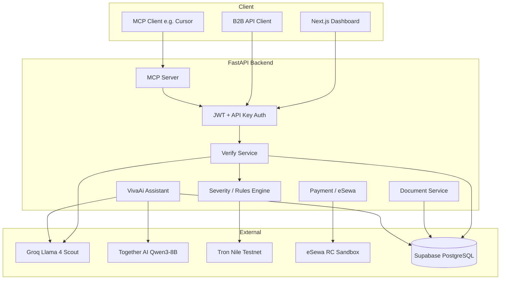

# VivadX — Full Project Documentation

**Team:** Team Tron  
**Product:** VivadX (Smart Document Reconciliation & Verification)  
**Assistant sub-brand:** VivaAi  
**Repository:** `TeamTron_iicquest`  
**Stack:** FastAPI · Next.js 15 · PostgreSQL (Supabase) · Groq Vision AI · Tron (Nile) · Together AI · eSewa

---

## Table of Contents

1. [Executive Summary](#1-executive-summary)
2. [Problem We Solve](#2-problem-we-solve)
3. [Solution Overview](#3-solution-overview)
4. [System Architecture](#4-system-architecture)
5. [Verification Pipeline](#5-verification-pipeline)
6. [Feature Reference](#6-feature-reference)
7. [Criteria & Rule Engine](#7-criteria--rule-engine)
8. [Database Schema](#8-database-schema)
9. [API Reference](#9-api-reference)
10. [Frontend Application](#10-frontend-application)
11. [AI & Models](#11-ai--models)
12. [Blockchain Layer](#12-blockchain-layer)
13. [Payments & Credits](#13-payments--credits)
14. [MCP Integration](#14-mcp-integration)
15. [Security & Auth](#15-security--auth)
16. [Project Structure](#16-project-structure)
17. [Environment Variables](#17-environment-variables)
18. [Setup & Development](#18-setup--development)
19. [Testing](#19-testing)
20. [Related Documentation](#20-related-documentation)

---

## 1. Executive Summary

**VivadX** is a B2B document verification platform built for **Nepal and similar markets**. Organizations upload 1–5 document images (KYC forms, certificates, contracts, manpower papers), and VivadX:

1. **Extracts** structured fields using vision AI (Groq Llama 4 Scout)
2. **Validates** them against configurable business rules (cross-match, expiry, thresholds, date logic)
3. **Scores** risk and assigns a **Green / Orange / Red** verdict
4. **Signs** clean (Green) verifications on the **Tron blockchain** as tamper-proof proof
5. **Stores** full results for dashboard, API, and AI assistant access

Target customers: **banks**, **microfinance**, **manpower agencies**, **consultancies**, **universities**, and **government** offices that still rely on manual document checks.

**Business model:** Pay-per-verification credits (1 NPR ≈ 1 credit ≈ 1 verification). Top-up via **eSewa**. B2B integration via **REST API** and **API keys**.

---

## 2. Problem We Solve

| Pain | Manual process today | VivadX outcome |
|------|---------------------|----------------|
| Speed | 5–15 minutes per document | Under 10 seconds |
| Cost | High staff labor per file | ~1 credit per verification |
| Consistency | Different officers, different results | Same rules every time |
| Fraud | Fake/mismatched docs slip through | Cross-match + expiry + flags |
| Audit | “We checked it” on paper | SHA-256 hash + public Tron TXID |

In Nepal, **106+ licensed BFIs** and **11,000+ branches** (NRB) still process KYC manually. Regulators now require **National ID-linked verification** (NRB, Jan 2025) and stricter AML rules — increasing load without adding staff.

---

## 3. Solution Overview

```
Company uploads documents + selects criteria
        ↓
Vision AI extracts fields (parallel, 1–5 images)
        ↓
Fields merged; conflicts detected across documents
        ↓
Rule engine applies criteria rules → flags
        ↓
Risk score (0–100) → verdict Green / Orange / Red
        ↓
Green → SHA-256 hash → Tron transaction → signature stored
        ↓
Full JSON result saved; credits deducted; dashboard updated
```

**Key differentiators:**

- **Criteria-driven** — new document types via JSON config, not code deploys
- **Multi-document reconciliation** — compares fields across uploads in one run
- **Blockchain proof** — public, verifier-independent audit trail for Green verdicts
- **Nepal-native payments** — eSewa credit top-up
- **AI assistant (VivaAi)** — context-aware chat over live company data
- **MCP server** — AI tools (Cursor, Claude) can verify and query natively

---

## 4. System Architecture



| Layer | Technology |
|-------|------------|
| Frontend | Next.js 15, React 19, TypeScript, Tailwind CSS 4, GSAP |
| Backend | FastAPI, SQLAlchemy 2, Alembic, Pydantic v2 |
| Database | PostgreSQL via Supabase (pooler + direct URL) |
| Vision AI | Groq — `meta-llama/llama-4-scout-17b-16e-instruct` |
| Assistant AI | Together AI — fine-tuned Qwen3-8B-Vivad; Groq fallback |
| Blockchain | Tron Nile testnet via `tronpy` |
| Payments | eSewa HMAC-signed redirect flow |
| Protocol | MCP (FastMCP) for AI tool exposure |

---

## 5. Verification Pipeline

### 5.1 Entry points

| Endpoint | Use case |
|----------|----------|
| `POST /api/v1/verify/upload` | Multipart upload + verify in one call |
| `POST /api/v1/verify` | Verify already-uploaded file paths |
| `POST /api/v1/document/verify` | Dashboard upload flow |

**Limits:** 1–5 images per run (JPG/PNG). **Auth:** JWT or `X-Api-Key`. **Cost:** 1 credit per run (from `plan.per_user`, default 1 NPR).

### 5.2 Extraction (Groq)

- `build_extraction_prompt(criteria)` builds a dynamic prompt from criteria fields + rule severities
- Images processed in **parallel** (max 2 concurrent via `MAX_PARALLEL`)
- **5 Groq API keys** with automatic fallback on rate limit / auth errors
- Output: strict JSON object with one key per criteria field

### 5.3 Merge & conflicts

`merge_extractions()` combines per-image results:

- First non-null value wins per field
- Disagreements → `conflicts` dict (e.g. `Name: ["Sarita Yadav", "Sarita Yadev"]`)

### 5.4 Synthetic detection (optional)

When `SYNTHETIC=True` in `.env`:

- Pre-check per image: AI-generated / mock-up detection
- Synthetic docs → **RED**, no field trust, suggestion *"This document is synthetic."*
- When `SYNTHETIC=False`, synthetic fields stripped from stored results

### 5.5 Rule engine → flags

See [Section 7](#7-criteria--rule-engine).

### 5.6 Scoring & verdict

| Severity | Weight |
|----------|--------|
| Green | 100 |
| Yellow | 75 |
| Orange | 50 |
| Red | 0 |

**Risk score** = average weight across all flags (0–100).

| Score | Verdict | Document status | Blockchain |
|-------|---------|-----------------|------------|
| ≥ 80 | Green | `verified` | Signed on Tron |
| 50–79 | Orange | `review` | Not signed |
| < 50 | Red | `failed` | Not signed |

### 5.7 Result payload (stored in `document_enroll.result`)

```json
{
  "document_enroll_id": "uuid",
  "paths": ["uploads/..."],
  "criteria": { "id": "...", "name": "Bank KYC", "category": "bank" },
  "extracted_fields": { "Name": "...", "Citizenship No.": "..." },
  "conflicts": {},
  "flags": [
    { "field": "Name", "severity": "red", "value": "...", "issue": "...", "is_critical": true }
  ],
  "suggestions": ["⚠️ CRITICAL: ...", "❌ Verification failed — document cannot be accepted"],
  "risk_score": 0,
  "verdict": "red",
  "documents": [],
  "tron_signed": false,
  "txid": null,
  "hash": null,
  "verify_url": null
}
```

Per-document summaries in `documents[]` when multiple images uploaded.

---

## 6. Feature Reference

### 6.1 Authentication & companies

- **Register / login** — company accounts (not individual users)
- **JWT** (HS256) for dashboard sessions
- **BCrypt** password hashing
- **Profile** — name, email, logo upload to `bucket/logo/`
- **Multi-tenant** — all data scoped by `company_id`

### 6.2 Document verification

- Upload 1–5 images per verification
- Parallel AI extraction
- Cross-document conflict detection
- Green / Orange / Red verdict + 0–100 risk score
- Per-field flags with human-readable issues
- Actionable suggestions list
- Per-document breakdown for multi-image runs
- Optional synthetic image detection
- Credit check before processing (HTTP 402 if insufficient)

### 6.3 Dynamic criteria engine

- Criteria stored as **JSONB** in PostgreSQL
- Defines `fields[]` and `rules[]`
- Companies **enroll** criteria to activate them
- **Categories** group criteria (bank, manpower, university, etc.)
- Custom criteria creatable via API

**Seeded templates** (`db/seed/`):

| Seed file | Name | Category |
|-----------|------|----------|
| `bank_kyc.py` | Bank KYC | bank |
| `manpower_agency.py` | Manpower Agency | manpower |
| `unicritaria.py` | University Documents | university |

Run all: `python db/seed/run_all.py`

### 6.4 Blockchain signing (Tron)

- Only **Green** verdicts signed
- SHA-256 hash of `{ enroll_id, document_id, criteria_id, fields }`
- 1 SUN transfer to **unique ephemeral address** per document; hash in memo
- `txid`, `to_address`, `hash` stored in `signature` table
- Public link: `https://nile.tronscan.org/#/transaction/{txid}`
- **Order enforced:** create `Signature` first, then set `document_enroll.status = verified`

### 6.5 Balance & credits

- `balance` table per company
- 1 verification = `plan.per_user` credits (typically 1)
- Deducted atomically after successful verify
- `GET /api/v1/balance` — JWT or API key

### 6.6 eSewa payments

- Initialize payment → redirect POST to eSewa RC sandbox
- HMAC-SHA256 signed requests/responses
- Success callback verifies signature → credits added
- Transaction history via `GET /api/v1/transaction`
- 1 NPR paid = 1 credit (1:1)

### 6.7 VivaAi assistant

- `POST /api/v1/assistant/chat`
- Injects live DB context (balance, recent verifications, criteria)
- Primary: Together AI fine-tuned **Qwen3-8B-Vivad**
- Fallback: Groq **Llama 3.3 70B** if Together unavailable
- Frontend: `/assistant` with optional `?enroll={id}` context

### 6.8 API keys (B2B)

- Generate / list / revoke keys per company
- Header: `X-Api-Key`
- Works on: verify, balance, dashboard, assistant, document list

### 6.9 Dashboard & analytics

`GET /api/v1/company/dashboard` returns:

- Document counts: total, verified, failed, pending, verification rate %
- Blockchain: total signatures
- Financials: total spent (NPR), payment count
- Active API keys, enrolled criteria count
- Last 5 verifications with verdict, risk score, TronScan links

### 6.10 Document history & results

- List all verifications: `GET /api/v1/document`
- Detail: `GET /api/v1/document/{enroll_id}`
- Full result JSON: `GET /api/v1/document/{enroll_id}/result`
- Serve uploaded files: `GET /api/v1/document/{enroll_id}/file/{index}`

### 6.11 Signatures registry

- `GET /api/v1/signature` — company’s blockchain proofs
- `GET /api/v1/signature/{enroll_id}` — single signature
- `GET /api/v1/signature/verify/{txid}` — **public** tx lookup (no auth)

### 6.12 MCP server

Location: `app/mcp/server.py`

| Tool | Description |
|------|-------------|
| `get_dashboard` | Company stats |
| `get_balance` | Credit balance |
| `list_criteria` | Enrolled criteria |
| `get_verification_history` | Recent documents |
| `ask_assistant` | VivaAi chat |
| `verify_document` | Run verification |

Auth: `VIVAD_API_KEY` + `VIVAD_BASE_URL` env vars.

---

## 7. Criteria & Rule Engine

### 7.1 Rule types (`app/utils/severity.py`)

| Check | What it does | Example |
|-------|--------------|---------|
| `cross_match` | Field value differs across uploaded docs | Name mismatch citizenship vs KYC form |
| `not_expired` | Date field before today | Expired KYC / license |
| `min_threshold` | Numeric field below minimum | GPA < 2.0, income < NPR 10,000 |
| `date_logic` | First date after second (impossible) | Payment date after deployment date |

Each rule has `severity`: `red`, `orange`, or `yellow`.

### 7.2 Bank KYC (seeded)

**Fields:** Name, Father Name, Citizenship No., PAN No., Expiry Date, Address, Amount, Document Type

**Red rules:** name/citizenship/PAN mismatch, expired document  
**Orange rules:** father name variation, address mismatch, low income (< NPR 10,000)

### 7.3 Manpower Agency (seeded)

**Fields:** Name, Father Name, Agency Name, License No., Amount, Destination, Expiry Date, Payment Date, Deployment Date

**Red rules:** name/salary/destination/license mismatch, expired license, payment after deployment  
**Orange rules:** agency name variation

### 7.4 University Documents (seeded)

**Fields:** student_name, student_id, father_name, university_name, faculty, program, degree_level, certificate_no, roll_no, issue_date, graduation_date, gpa, document_type

**Red rules:** student name/ID/university/certificate/roll mismatches, graduation before issue  
**Orange rules:** program mismatch, father name variation  
**Threshold:** GPA minimum 2.0

### 7.5 Adding a new criteria

1. Define JSON: `{ name, category, fields[], rules[] }`
2. `POST /api/v1/criteria` or add a seed script
3. Companies `POST /api/v1/criteria/enroll`
4. No backend code change required for extraction prompt — built dynamically

---

## 8. Database Schema

PostgreSQL via Supabase. Migrations in `backend/db/migration/versions/`.

| Table | Purpose |
|-------|---------|
| `company` | Tenant: name, email, logo, status |
| `auth` | BCrypt password hash per company |
| `category` | Document category labels |
| `category_enroll` | Company ↔ category |
| `criteria` | JSONB criteria definitions |
| `criteria_enroll` | Company ↔ criteria activation |
| `document` | `multipaths` — file paths for one upload batch |
| `document_enroll` | Company submission: status, full `result` JSONB |
| `signature` | Blockchain proof: hash, txid, to_address |
| `apikey` | Hashed API keys, active/revoked |
| `balance` | Credit balance per company |
| `plan` | Cost per verification (`per_user`) |
| `payment` | eSewa payment records |
| `payment_method` | Supported gateways (eSewa, etc.) |
| `transaction` | Wallet transaction log |

### Document enroll statuses

| Status | Meaning |
|--------|---------|
| `pending` | Uploaded, not yet verified or in progress |
| `verified` | Green verdict + blockchain signed |
| `failed` | Red verdict |
| `review` | Orange verdict — needs human review |

---

## 9. API Reference

**Base URL:** `http://localhost:8000/api/v1` (dev)  
**Health:** `GET /health`  
**OpenAPI:** `http://localhost:8000/docs`

### Auth

| Method | Path | Auth | Description |
|--------|------|------|-------------|
| POST | `/auth/register` | — | Create company |
| POST | `/auth/login` | — | Get JWT |

### Company

| Method | Path | Auth | Description |
|--------|------|------|-------------|
| GET | `/company/me` | JWT | Profile |
| PATCH | `/company/me` | JWT | Update profile |
| POST | `/company/logo` | JWT | Upload logo |
| GET | `/company/dashboard` | JWT / API key | Analytics |

### Verify

| Method | Path | Auth | Description |
|--------|------|------|-------------|
| POST | `/verify` | JWT / API key | Verify by paths |
| POST | `/verify/upload` | JWT / API key | Upload + verify |

### Document

| Method | Path | Auth | Description |
|--------|------|------|-------------|
| GET | `/document` | JWT | List verifications |
| GET | `/document/{id}` | JWT | Metadata |
| GET | `/document/{id}/result` | JWT | Full result JSON |
| GET | `/document/{id}/file/{i}` | JWT | Image file |
| POST | `/document/verify` | JWT | Dashboard verify |

### Criteria & category

| Method | Path | Auth | Description |
|--------|------|------|-------------|
| GET | `/criteria` | JWT | List criteria |
| POST | `/criteria` | JWT | Create criteria |
| POST | `/criteria/enroll` | JWT | Enroll |
| GET | `/criteria/enrolled` | JWT | Enrolled list |
| GET | `/category` | JWT | Categories |
| POST | `/category/enroll` | JWT | Enroll category |

### Blockchain

| Method | Path | Auth | Description |
|--------|------|------|-------------|
| GET | `/signature` | JWT | List signatures |
| GET | `/signature/{enroll_id}` | JWT | One signature |
| GET | `/signature/verify/{txid}` | **Public** | Verify on-chain |

### Payments & balance

| Method | Path | Auth | Description |
|--------|------|------|-------------|
| GET | `/balance` | JWT / API key | Balance |
| POST | `/payment/initialize` | JWT | Start eSewa |
| GET | `/payment/success` | — | eSewa callback |
| GET | `/transaction` | JWT | History |

### Other

| Method | Path | Auth | Description |
|--------|------|------|-------------|
| POST | `/apikey` | JWT | Create key |
| GET | `/apikey` | JWT | List keys |
| DELETE | `/apikey/{id}` | JWT | Revoke |
| POST | `/assistant/chat` | JWT / API key | VivaAi chat |
| GET | `/plan` | JWT | Pricing plan |

Full Postman collection: `backend/docs/frontend/postman/Apilist.json`

---

## 10. Frontend Application

**Path:** `frontend/`  
**Dev:** `npm run dev` → `http://localhost:3000`  
**Brand config:** `frontend/src/lib/brand.ts`

### Public pages

| Route | Purpose |
|-------|---------|
| `/` | Marketing landing page |
| `/login` | Company login |
| `/register`, `/signup` | Registration |
| `/verify/[txid]` | Public blockchain verify |

### Authenticated app (`(app)` layout)

| Route | Purpose |
|-------|---------|
| `/dashboard` | Stats, charts, recent verifications |
| `/documents` | Document list |
| `/documents/upload` | Upload & verify |
| `/documents/[enrollId]` | Document detail |
| `/documents/[enrollId]/result` | Full result: summary, issues, gallery, blockchain |
| `/verify` | Quick verify workspace |
| `/criteria` | Browse & enroll criteria |
| `/signatures` | Blockchain proof registry |
| `/assistant` | VivaAi chat (`?enroll=` for document context) |
| `/settings/profile` | Company profile |
| `/settings/balance` | Credits & top-up |
| `/settings/payments` | Payment history |
| `/settings/api-keys` | API key management + API docs panel |

### Key result UI components

| Component | Role |
|-----------|------|
| `result-summary.tsx` | Verdict, score, status, criteria, on-chain |
| `result-issues-summary.tsx` | Failed verification issues at top |
| `result-panel.tsx` | Flags, gallery, extracted fields, blockchain |
| `uploaded-documents-gallery.tsx` | Multi-doc image viewer + lightbox |
| `per-document-results.tsx` | Per-image verdicts |
| `tron-scan-link.tsx` | Nile TronScan links |

---

## 11. AI & Models

### Vision extraction (primary)

| Setting | Value |
|---------|-------|
| Provider | Groq |
| Model | `meta-llama/llama-4-scout-17b-16e-instruct` |
| Temperature | 0.1 |
| Output | `response_format: json_object` |
| Parallelism | 2 images at a time |
| Keys | `GROQ_API_KEY` … `GROQ_API_KEY5` (fallback chain) |

### Assistant (VivaAi)

| Setting | Value |
|---------|-------|
| Primary | Together AI — `TOGETHER_MODEL` (Qwen3-8B-Vivad fine-tune) |
| Fallback | Groq — `llama-3.3-70b-versatile` |
| Context | `app/core/vectorless/context.py` — live DB injection |

### Prompt builder

`app/core/prompts/base.py`:

- Reads criteria fields + rule severities
- Injects date/amount/name extraction hints
- Optional synthetic detection instructions when `SYNTHETIC=True`

---

## 12. Blockchain Layer

**Network:** Tron **Nile testnet** (production-ready pattern; switch via `TRON_GRID_API`)

**Flow (`app/service/tron/tron.py`):**

1. `hash_fields()` — SHA-256 of canonical JSON
2. `_generate_address()` — fresh ephemeral TRON address per document
3. Broadcast 1 SUN `from_addr → to_addr` with hash in memo
4. Return `{ txid, to_address }`

**Why ephemeral `to_address`:** Each document gets a unique on-chain fingerprint — one address, one verification transaction.

**Public verification:** Anyone with `txid` can open TronScan or call `GET /signature/verify/{txid}`.

---

## 13. Payments & Credits

```
User selects amount (NPR) on /settings/balance
    → POST /payment/initialize
    → Browser POST redirect to eSewa
    → User pays
    → GET /payment/success?data=... (signed)
    → Backend verifies HMAC → adds credits to balance
    → Transaction logged
```

| Concept | Value |
|---------|-------|
| Currency | NPR |
| Credit ratio | 1 NPR = 1 credit |
| Verify cost | `plan.per_user` (default 1 credit) |
| Insufficient balance | HTTP 402 on verify |

---

## 14. MCP Integration

**Run:** Configure in Cursor / Claude Desktop with `app/mcp/server.py`

**Environment:**

```env
VIVAD_BASE_URL=http://localhost:8000
VIVAD_API_KEY=your-company-api-key
```

Enables AI agents to check balance, list criteria, run verifications, and ask VivaAi — without custom integration code.

Docs: `backend/docs/mcp/Readme`

---

## 15. Security & Auth

| Mechanism | Details |
|-----------|---------|
| Passwords | BCrypt hashed |
| Sessions | JWT bearer tokens |
| B2B | `X-Api-Key` header; keys stored hashed |
| CORS | `ALLOWED_ORIGINS` env |
| Credits | Pre-check prevents unpaid AI calls |
| eSewa | HMAC signature verification on callbacks |
| Multi-tenant | All queries filtered by `company_id` |
| File access | Document files scoped to owning company |

**Data retention:** Extracted fields + result JSON + blockchain hash stored. Raw images on server under `uploads/`; companies control their enrollments.

---

## 16. Project Structure

```
TeamTron_iicquest/
├── backend/
│   ├── main.py                 # FastAPI app entry
│   ├── app/
│   │   ├── api/v1/             # REST routes (auth, verify, document, …)
│   │   ├── core/prompts/       # Dynamic AI prompts
│   │   ├── helper/             # JWT, deps, CRUD helpers
│   │   ├── mcp/                # MCP server
│   │   ├── service/
│   │   │   ├── groq/           # Vision extraction
│   │   │   └── tron/           # Blockchain signing
│   │   └── utils/severity.py   # Rule engine
│   ├── db/
│   │   ├── models/             # SQLAlchemy models
│   │   ├── migration/          # Alembic
│   │   └── seed/               # Criteria seeds
│   ├── unit/                   # Tests (synthetic, university, e2e)
│   └── docs/                   # Documentation
│       ├── project/details.md  # This file
│       ├── features/list.md
│       ├── presentguide/
│       └── frontend/postman/
└── frontend/
    ├── src/app/                # Next.js pages
    ├── src/components/         # UI components
    └── src/lib/                # API client, brand, utils
```

---

## 17. Environment Variables

See `backend/.env.example`:

| Variable | Purpose |
|----------|---------|
| `DATABASE_URL` | Supabase pooler connection |
| `SUPABASE_*` | Supabase project keys |
| `JWT_SECRET` | Token signing |
| `GROQ_API_KEY*` | Vision AI (up to 5 keys) |
| `TOGETHER_API_KEY` | Assistant model |
| `TOGETHER_MODEL` | Fine-tuned model ID |
| `TRON_PRIVATE_KEY` | Signing wallet |
| `TRON_GRID_API` | Nile/testnet endpoint |
| `ESEWA_*` | Payment gateway |
| `SYNTHETIC` | `True`/`False` — synthetic doc detection |
| `ALLOWED_ORIGINS` | CORS |
| `BACKEND_URL` / `FRONTEND_URL` | Redirect URLs |

---

## 18. Setup & Development

### Backend

```bash
cd backend
python -m venv .venv && source .venv/bin/activate
pip install -r requirements.txt
cp .env.example .env   # fill in secrets
alembic upgrade head
python db/seed/run_all.py
uvicorn main:app --reload --host 127.0.0.1 --port 8000
```

### Frontend

```bash
cd frontend
npm install
# set NEXT_PUBLIC_API_URL in .env.local if needed
npm run dev
```

### Health check

```bash
curl http://127.0.0.1:8000/health
# {"status":"ok","service":"VIVAD X"}
```

---

## 19. Testing

| File | Coverage |
|------|----------|
| `unit/test_synthetic.py` | Synthetic detection on/off |
| `unit/test_university_criteria.py` | University rules & scoring |
| `unit/smoke_test.py` | Basic API smoke |
| `unit/e2e_test.py`, `e2e_test2.py` | End-to-end flows |

```bash
cd backend && python -m pytest unit/test_synthetic.py unit/test_university_criteria.py -v
```

---

## 20. Related Documentation

| Document | Path |
|----------|------|
| Feature list (concise) | `backend/docs/features/list.md` |
| 4-minute pitch script | `backend/docs/presentguide/1.4minproblemandFeatures.md` |
| Judge Q&A | `backend/docs/speech/judgesqna.txt` |
| API Postman | `backend/docs/frontend/postman/Apilist.json` |
| API workflow | `backend/docs/frontend/postman/workflow.txt` |
| Frontend pages | `backend/docs/frontend/pages/list.txt` |
| DB schema notes | `backend/docs/schema/db.txt` |
| Image/verify flow | `backend/docs/imageflow/flow.txt` |
| MCP setup | `backend/docs/mcp/Readme` |

---

## Quick Reference Card

| Question | Answer |
|----------|--------|
| Who built it? | **Team Tron** |
| Product name? | **VivadX** |
| AI assistant? | **VivaAi** |
| How fast? | < 10 seconds per verification |
| Verdicts? | Green (pass) · Orange (review) · Red (fail) |
| When blockchain? | Green only |
| Cost model? | 1 credit = 1 verification ≈ 1 NPR |
| Nepal payment? | eSewa |
| B2B auth? | `X-Api-Key` |
| Add new doc type? | New criteria JSON — no code deploy |

---

*Last updated: Team Tron · VivadX · IIC Quest*
